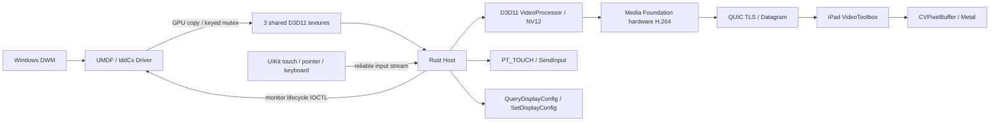

# SidecarDOS

SidecarDOS 把 iPad 用作 Windows 11 的无线扩展显示器。Windows 端通过 UMDF 2 / IddCx 创建真实的虚拟显示器；Rust Host 编码并传输该显示器的 compositor 帧；iPad 用 VideoToolbox 和 Metal 显示，并回传触摸、鼠标和物理键盘事件。

仅支持 Windows 11 x64 Host 与 iPadOS Client。没有 RDP、VNC、WebRTC、浏览器运行时、Duet 协议或桌面截图采集路径。

## 当前验证状态

- Rust Host 与 D3D11 / Media Foundation bridge 已在 Windows 上编译、链接，并通过严格 Clippy 检查。
- 协议、配对证明、防重放、显示模式、拓扑重试、键码和重连测试，以及实际 QUIC 加密连接的控制流 / Datagram 集成测试已实现。
- Driver 已使用 Microsoft 官方 WDK 10.0.26100 编译、链接，通过 InfVerif 和 Inf2Cat 校验，生成未签名 DLL / INF / CAT。
- 本机 GPU 的离屏硬件 H.264 编码测试已运行。该测试通过 GPU 纹理输入验证 IDR 输出，不依赖已安装的显示驱动。
- **尚未在当前环境完成 Xcode 编译、Apple 签名、驱动签名安装、Windows → 实际 iPad 的完整联调或 1080p60 无线性能验收。** 不应把局部编译和 GPU 自检当作完整 MVP 已验收。

具体验证记录见 [docs/validation.md](docs/validation.md)。

## Architecture



```text
windows/driver/       IddCx adapter、monitor、EDID、swapchain 和 GPU 帧交接
windows/host/src/     Rust session、QUIC、配对、配置、输入、拓扑、日志、tray
windows/host/native/ 小型 D3D11 / Media Foundation COM bridge
windows/installer/   驱动安装、局域网防火墙和当前用户自启动脚本
ipad/SidecarDOS/      SwiftUI、Network.framework、VideoToolbox、Metal、UIKit
protocol/            语言无关 schema、Rust / Swift 类型生成器和协议说明
docs/                构建、协议安全、资源生命周期和联调记录
```

## Windows requirements

- Windows 11 x64，交互式登录用户会话。
- 支持 D3D11 VideoProcessor 和 GPU NV12 输入的 H.264 hardware MFT。
- NVIDIA、AMD、Intel 通过 MFTEnum2 与 render-adapter LUID 自动选择；没有厂商硬编码。当前只在本机实际 GPU 上验证，不能据此保证所有厂商驱动版本兼容。
- Microsoft Visual C++ x64 运行库。开发环境需 Visual Studio 2022 C++ Build Tools、Windows SDK 10.0.26100、Rust stable（依赖最低 Rust 1.88）、Node.js 22+。
- Driver 使用 WDK 10.0.26100、UMDF 2.25、IddCx 1.2。现代 Windows 11 提供这些运行时 API。
- Host 使用普通用户权限运行。输入注入遵守 Windows UIPI，不能控制管理员提升窗口、UAC 安全桌面或登录界面。

## Build Host

在仓库根目录运行：

```powershell
node protocol/generate.mjs --check
cargo test --workspace --locked
cargo clippy --workspace --all-targets --locked -- -D warnings
cargo build --release --locked
```

输出为 `target/release/sidecardos-host.exe`。也可使用：

```powershell
./windows/build.ps1
```

有物理 GPU 的 Windows 开发机可额外运行：

```powershell
cargo test --workspace hardware_encoder_produces_idr -- --ignored --nocapture
```

这是离屏硬件编码自检，不会创建显示器、注入输入或采集屏幕。普通 CI 默认跳过这个硬件测试。

## Build Driver

安装了 WDK 的 Visual Studio Developer PowerShell：

```powershell
./windows/build.ps1 -Driver
```

也提供不要求把 WDK 安装进系统的构建脚本，使用 Microsoft 官方 NuGet 包：

```powershell
New-Item -ItemType Directory -Force .local/wdk | Out-Null
Invoke-WebRequest https://api.nuget.org/v3-flatcontainer/microsoft.windows.wdk.x64/10.0.26100.6584/microsoft.windows.wdk.x64.10.0.26100.6584.nupkg -OutFile .local/wdk.nupkg
Expand-Archive .local/wdk.nupkg .local/wdk -Force
./windows/driver/Build-Nuget.ps1 -WdkRoot .local/wdk/c
```

该脚本编译 DLL，校验 INF 并生成 catalog；输出为 `build/driver/Release/`。它不安装驱动、不创建证书、不修改 Windows 签名策略。

### Driver signing / test signing

生成的 package **未签名，不能直接当作可分发的正式驱动安装**。开发者需要在专用测试机上按 Microsoft 文档使用测试证书签署 DLL 和 CAT，信任证书并启用测试签名。生产发布需要遵循 Microsoft 的驱动签名和 Hardware Developer Program 流程。

项目不会自动切换 TESTSIGNING、关闭 Secure Boot 或安装根证书。参考 [Microsoft 测试签名文档](https://learn.microsoft.com/en-us/windows-hardware/drivers/install/test-signing)。

已签名后，在管理员 PowerShell 中：

```powershell
./windows/installer/Install-Driver.ps1 -Package ./build/driver/Release -Devcon ./.local/wdk/c/tools/10.0.26100.0/x64/devcon.exe
./windows/installer/Configure-Firewall.ps1 -HostExecutable ./target/release/sidecardos-host.exe
```

防火墙规则仅允许 Private profile、LocalSubnet 来源的 UDP 47736 和 mDNS 5353。安装脚本在设备已存在时更新 package，避免重复创建 root device。

Host 仍在普通用户会话启动。可选自启动：

```powershell
./windows/installer/Set-Autostart.ps1 -HostExecutable ./target/release/sidecardos-host.exe
```

## Build iPad Client

需要 macOS、Xcode 16+、XcodeGen，部署目标 iPadOS 17.0，设备类型仅 iPad。Mac 仅作为 Apple 工具链构建机，不是 SidecarDOS Host。

```sh
cd ipad
xcodegen generate
open SidecarDOS.xcodeproj
```

在 Xcode 为 SidecarDOS target 设置自己的 Development Team 和 bundle identifier，再部署到 iPad。模拟器可用于界面 / 协议构建与测试；GPU 硬件解码、触摸、trackpad 和网络性能需要真机。

无签名的构建检查：

```sh
xcodebuild -project SidecarDOS.xcodeproj -scheme SidecarDOS -sdk iphonesimulator -destination 'generic/platform=iOS Simulator' CODE_SIGNING_ALLOWED=NO build-for-testing
```

`ipad/project.yml` 生成 Info.plist 中的 Local Network privacy 文案和 `_sidecardos._udp` Bonjour 声明。CI 包含 Windows 构建及 macOS iPad 构建任务；这里没有声称远端 CI 已执行。

## Pairing

1. 正常启动 Host。未认证连接不会创建显示器，也不能注入输入。
2. iPad 在 Available PCs 中发现并选择 Windows PC。
3. Windows 原生配对窗口显示一次性 32 位十六进制代码（128 bit），有效期 90 秒。
4. iPad 输入代码。HMAC-SHA256 证明绑定 server certificate hash、client identity、随机 nonce 和方向，双方确认后保存设备密钥。
5. 后续连接校验已保存的证书，并使用长期随机密钥认证。

这里使用较长代码，以避免把短 PIN 的离线猜测风险隐藏在自定义加密方案中。代码、长期密钥和私钥不进入日志。Windows 身份文件由当前用户 DPAPI 加密；iPad 使用 Keychain 的 ThisDeviceOnly 存储。QUIC 使用 TLS，禁用 0-RTT。

iPad 的 Settings 可忘记当前 PC；Host 退出后运行 `sidecardos-host.exe --forget-devices` 可撤销所有客户端。认证详细定义见 [protocol/README.md](protocol/README.md)。

## Display / video lifecycle

认证成功后，iPad 报告物理与逻辑尺寸、scale、safe area、orientation 和 refresh rate。Host 生成与当前 iPad 纵横比匹配的多个偶数尺寸模式，包含保持纵横比的模式及 1920×1080 / 1080×1920 经济模式，默认倾向 1080p，而非直接使用 Retina native resolution。

同一 iPad 的 monitor container GUID 和 EDID serial 保持稳定。Driver 的显示模式与 session 绑定；普通断网保留显示器 4 秒，显式断开、宽限期到期或 Host handle 关闭时 departure。方向变化重新协商 capabilities，必要时以同一 identity 更新 monitor modes。

swapchain 的纹理由 Driver GPU copy 到三个共享纹理中。Host 通过 keyed mutex 获取最新帧，VideoProcessor 在 GPU 上转换 NV12，再向硬件 MFT 提交 DXGI surface sample。没有 GPU → CPU → GPU 的未压缩帧搬运。压缩后的 H.264 字节进入 QUIC。

H.264 使用 8 bit、4:2:0、Baseline、无 B 帧、实时/低延迟设置。编码器支持运行时 bitrate 和 keyframe；分辨率 / refresh rate 改变时释放并重建 MFT 与共享纹理。每个 IDR 重带 SPS/PPS，供解码器重置和丢包恢复使用。

Driver 不处理网络、配对、编码、UI 或用户配置。它不会等待 Host 完成编码；Host 不在时不忙轮询。详见 [docs/lifecycle.md](docs/lifecycle.md)。

## Topology and configuration

`%LOCALAPPDATA%/SidecarDOS/config.toml` 首次启动时自动生成：

```toml
port = 47736

[display]
position = "right"
primary = false
reconnect_grace_ms = 4000

[video]
fps = 60
bitrate = 12000000
min_bitrate = 2000000
max_bitrate = 30000000
adaptive = true
```

支持 left、right、above、below。MVP 固定 Extend；Windows Settings 可调整实际分辨率和 DPI/UI scaling。托盘可切换位置和 Auto / Performance / Quality，Settings 打开配置文件。手动修改配置在重启 Host 后生效。

拓扑识别使用 monitor device path、SidecarDOS EDID manufacturer/product、adapter LUID 和 source/target ID，不使用“显示器 1/2/3”。显示变化经过 200 ms debounce、状态比较、最多 3 次重试和 750 ms 稳定期，再调用 SetDisplayConfig 并重新查询确认。

## Input and statistics

- 多点触摸发送 normalized 坐标，在 Host 映射到虚拟显示器的当前 desktop bounds，使用 PT_TOUCH / InjectSyntheticPointerInput。
- Mouse / trackpad 支持 absolute / relative 事件、左中右键、纵向和横向滚动。触摸活动期间抑制重复 mouse 注入。
- 键盘协议携带 USB HID physical key、logical scalar、modifiers、down/up/repeat；Host 使用 scan code 注入。Command 对应 Win，Option 对应 Alt。两端应选择匹配的硬件键盘布局；iPadOS 保留的系统快捷键无法全部转发。
- 断线、后台切换和故障会清理按键、鼠标按钮及触点。
- Overlay 显示 FPS、bitrate、RTT、丢包估算、decode、render 和估算端到端延迟。capture / encode / send / receive / decode / present 均保留时戳。
- 通过 Ping/Pong 估算跨设备 monotonic clock offset，端到端数字是估算值，不是硬件同步测量。

## Logs and current limitations

Windows 日志：`%LOCALAPPDATA%/SidecarDOS/host.log`，使用 tracing 的 target 与结构化字段。设置 `RUST_LOG=sidecardos_host=debug,network=debug,topology=debug` 可查看统计与排错信息。Driver 异常也会发送调试输出；UMDF/WDF 故障需要结合系统事件和 WDK 调试器调查。iPad 使用 os.Logger。

- 尚未进行签名安装后的跨进程 GPU 共享和真实 iPad 全链路验收；见验证记录。
- 目前只接受 GPU 输入的硬件 H.264 MFT；没有软件编码 fallback。缺少兼容硬件编码器时显式失败并清理显示器。
- 不包含 HEVC/AV1、HDR/10-bit、120 Hz、Pencil/PT_PEN、音频、剪贴板、USB 或多 iPad。协议字段和模块边界保留后续扩展位置。
- 单用户、单 iPad、单虚拟显示器。没有 Session 0 桌面控制，也不处理受保护内容、DRM 绕过或安全桌面。
- UI 为基础原生 tray / SwiftUI；配对输入使用完整高熵代码，尚无扫码界面。
- iPad 旋转时会重连并重新协商模式，可能短暂黑屏。正式发布前须完成实际设备的锁屏、后台、Wi-Fi 变化和显示拓扑测试。

开发设计参考：[Microsoft IddSample](https://github.com/microsoft/Windows-driver-samples/tree/main/video/IndirectDisplay)、[Microsoft Hardware MFTs](https://learn.microsoft.com/en-us/windows/win32/medfound/hardware-mfts)、[Apple QUIC](https://developer.apple.com/videos/play/wwdc2021/10094/)、[Apple QUIC Datagram](https://developer.apple.com/videos/play/wwdc2022/10078/)。
