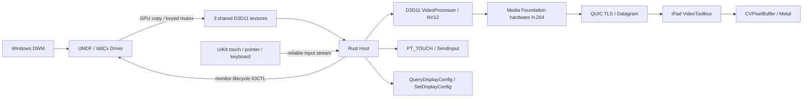

# Advanced guide

[English README](../README.md) · [中文 README](../README.zh-CN.md) · [Development and validation status](validation.md)

This guide covers source builds, installation, configuration and implementation details. Commands below run from the repository root unless stated otherwise. A Windows developer package has a different directory layout; use its `INSTALL.txt` for installation commands.

## Windows setup

### Build prerequisites

- Windows 11 x64 and Visual Studio 2022 with C++ Build Tools.
- Windows SDK 10.0.26100 and WDK 10.0.26100 for the display driver.
- Rust stable, at least 1.88, and Node.js 22 or later.
- A GPU supporting D3D11 VideoProcessor and a hardware H.264 Media Foundation transform accepting GPU NV12 input.
- Microsoft Visual C++ x64 runtime on the machine running the Host.

The driver uses UMDF 2.25 and IddCx 1.2. The Host runs in the interactive user's session.

### Build the Host

```powershell
node protocol/generate.mjs --check
cargo test --workspace --locked
cargo clippy --workspace --all-targets --locked -- -D warnings
cargo build --release --locked
```

The executable is `target/release/sidecardos-host.exe`. The build script runs the protocol check, tests, lint and release build:

```powershell
./windows/build.ps1
```

A separate hardware encoder self-test is available on a Windows machine with a physical GPU:

```powershell
cargo test --workspace hardware_encoder_produces_idr -- --ignored --nocapture
```

It renders offscreen GPU textures and tests H.264 output. It does not capture the desktop, inject input or install a display driver. Ordinary CI skips this hardware test.

### Build the driver

With the WDK installed, run from a Visual Studio Developer PowerShell:

```powershell
./windows/build.ps1 -Driver
```

Alternatively, build using the official Microsoft WDK NuGet package without installing the WDK into the system:

```powershell
New-Item -ItemType Directory -Force .local/wdk | Out-Null
Invoke-WebRequest https://api.nuget.org/v3-flatcontainer/microsoft.windows.wdk.x64/10.0.26100.6584/microsoft.windows.wdk.x64.10.0.26100.6584.nupkg -OutFile .local/wdk.zip
Expand-Archive .local/wdk.zip .local/wdk -Force
./windows/driver/Build-Nuget.ps1 -WdkRoot .local/wdk/c
```

This script compiles the DLL, validates the INF and generates the catalog in `build/driver/Release/`.

### Sign and install

Local builds produce an unsigned driver package. Sign the DLL and CAT before installation. On a dedicated development machine, follow Microsoft's [test-signing procedure](https://learn.microsoft.com/en-us/windows-hardware/drivers/install/test-signing) to sign and trust a test certificate and configure test signing. Production distribution requires the applicable Microsoft driver-signing process.

The project scripts do not create certificates or change TESTSIGNING or Secure Boot settings.

After signing, run in an administrator PowerShell:

```powershell
./windows/installer/Install-Driver.ps1 -Package ./build/driver/Release -Devcon ./.local/wdk/c/tools/10.0.26100.0/x64/devcon.exe
./windows/installer/Configure-Firewall.ps1 -HostExecutable ./target/release/sidecardos-host.exe
```

If using an installed WDK, supply the path to its `devcon.exe`. The installer updates an existing SidecarDOS device instead of creating another root device.

Firewall rules allow UDP 47736 and mDNS UDP 5353 from LocalSubnet sources on the Private profile. Keep the Host running as the regular logged-in user after installation.

### Start automatically and package builds

To start the Host when the current user logs in:

```powershell
./windows/installer/Set-Autostart.ps1 -HostExecutable ./target/release/sidecardos-host.exe
```

After building the Host and driver, create the Windows developer package:

```powershell
./windows/package.ps1
```

The archive is `build/SidecarDOS-windows-x64.zip`.

## iPad setup

Use macOS with Xcode 16 or later and XcodeGen. The deployment target is iPadOS 17.0, with iPad as the only supported device family. The Mac is a build machine; the display Host runs on Windows.

```sh
cd ipad
xcodegen generate
open SidecarDOS.xcodeproj
```

In Xcode, set your Development Team and bundle identifier for the SidecarDOS target, then deploy to the iPad.

For an unsigned simulator build check:

```sh
xcodebuild -project SidecarDOS.xcodeproj -scheme SidecarDOS -sdk iphonesimulator -destination 'generic/platform=iOS Simulator' CODE_SIGNING_ALLOWED=NO build-for-testing
```

`ipad/project.yml` supplies the Local Network privacy description and the `_sidecardos._udp` Bonjour declaration. Hardware decoding, input and wireless performance require a physical iPad. The repository's CI definition includes Windows and macOS build jobs; execution results are tracked separately in the [validation record](validation.md).

## Configuration

On first launch, the Host creates `%LOCALAPPDATA%/SidecarDOS/config.toml`:

```toml
port = 47736

[display]
position = "right"
primary = false
reconnect_grace_ms = 4000

[video]
fps = 60
bitrate = 12000000
min_bitrate = 2000000
max_bitrate = 30000000
adaptive = true
```

Display positions are `left`, `right`, `above` and `below`. The display uses Extend mode. Windows Display Settings controls the actual resolution and DPI/UI scaling.

Tray changes apply and persist immediately. Manual file edits take effect after restarting the Host. If you change the network port, update the firewall rule to match.

The reconnect grace period defaults to four seconds and accepts values from one to ten seconds. An authenticated reconnect within that interval retains the virtual display identity and layout. Explicit disconnect or grace expiry removes the display.

## Pairing and trust management

The first connection displays a one-time 32-character hexadecimal code on Windows, valid for 90 seconds. Enter it on the iPad to pair.

Pairing uses a 128-bit code and HMAC-SHA256 proofs bound to the server certificate hash, client identity, random nonce and direction. Reconnects verify the pinned certificate and use a saved device secret. QUIC provides TLS encryption with 0-RTT disabled.

Windows stores identity material encrypted with current-user DPAPI. The iPad stores device secrets in Keychain with ThisDeviceOnly protection. Codes, secrets and private keys are excluded from logs.

To forget a PC, use Settings on the iPad. To revoke all iPads on Windows, first exit the Host, then run from the executable's directory:

```powershell
./sidecardos-host.exe --forget-devices
```

The complete authentication and version-negotiation contract is in the [protocol specification](../protocol/README.md).

## Troubleshooting and diagnostics

- **PC not discovered:** confirm both devices share a local network, the iPad has Local Network permission, and Windows firewall rules match the Host path and port.
- **Display does not appear:** check the driver installation and signing, then inspect Host logs for driver or display errors.
- **Encoder creation fails:** check the GPU driver and hardware H.264 support. The Host requires a compatible GPU-input hardware encoder; it does not select a software fallback.
- **Keyboard shortcuts differ:** select matching hardware keyboard layouts on Windows and iPadOS. Command maps to Win and Option to Alt; iPadOS may retain some system shortcuts.
- **Input does not reach an elevated window:** the Host follows Windows UIPI and cannot control administrator-elevated windows, UAC secure desktops or the sign-in screen.

Host logs are at `%LOCALAPPDATA%/SidecarDOS/host.log`. For more detail, set `RUST_LOG=sidecardos_host=debug,network=debug,topology=debug` before launching the Host. Logs use tracing targets and structured fields. Driver failures also emit debugger output; UMDF/WDF investigation may require Windows events and WDK debugging tools. The iPad app uses `os.Logger`.

The iPad overlay reports FPS, bitrate, RTT, estimated loss, decode time, render time and estimated end-to-end latency. Ping/Pong estimates the offset between device monotonic clocks; these latency values are estimates, not measurements from synchronized hardware clocks. Simulator builds use GPU command completion in place of unavailable drawable presentation callbacks, so their statistics do not measure actual display latency.

## Architecture



### Repository layout

- `windows/driver/`: IddCx adapter, monitor, EDID, swapchain and GPU frame handoff.
- `windows/host/src/`: Rust session, transport, pairing, configuration, input, topology, logging and tray.
- `windows/host/native/`: D3D11 / Media Foundation COM bridge.
- `windows/installer/`: driver installation, local-network firewall and per-user startup scripts.
- `ipad/SidecarDOS/`: SwiftUI, Network.framework, VideoToolbox, Metal and UIKit.
- `protocol/`: language-independent schema, Rust/Swift generation and wire specification.
- `docs/`: advanced usage, resource ownership and validation records.

### Display and video pipeline

After authentication, the iPad reports physical and logical size, scale, safe area, orientation and refresh rate. The Host derives several even-sized display modes, including aspect-preserving modes and a fitting 1920×1080 or 1080×1920 option. The default favors a workload near 1080p instead of blindly selecting Retina native resolution.

Monitor container identity and EDID serial remain stable for the same iPad. Rotation renegotiates modes through a reconnect and can briefly interrupt the image.

The driver copies compositor frames into three shared D3D11 textures. The Host selects the latest frame through a keyed mutex, converts it to NV12 on the GPU and submits DXGI surface samples to Media Foundation. Uncompressed frames do not travel through a GPU → CPU → GPU path. Only compressed H.264 bytes enter the network transport.

Hardware encoders are selected through MFTEnum2 using the render adapter LUID, without vendor-specific selection rules. H.264 uses 8-bit 4:2:0 Baseline, no B frames and low-latency settings. Bitrate and keyframes can change at runtime. Resolution or refresh-rate changes recreate encoder resources. Every IDR repeats SPS/PPS for decoder recovery.

Queues are bounded and prefer recent frames. QUIC Datagrams carry video fragments so packet loss does not block subsequent frames behind retransmission. Control and input use reliable streams.

The driver handles display and GPU handoff only; networking, authentication, encoding, UI and configuration belong to the Host. See [resource ownership and recovery](lifecycle.md) for resource limits and cleanup behavior.

### Topology and input

Topology identification uses the monitor device path, SidecarDOS EDID manufacturer/product, adapter LUID and source/target IDs. It does not rely on Windows display numbers. Reconciliation uses a 200 ms debounce, state comparison, at most three retries and a 750 ms stabilization period before verification.

Touch events carry normalized coordinates mapped to current virtual-display desktop bounds and are injected as real PT_TOUCH contacts. Mouse events support absolute/relative movement, three buttons and vertical/horizontal scrolling. Active touch suppresses duplicate mouse injection.

Keyboard messages carry USB HID physical keys, logical scalars, modifiers and down/up/repeat state. Windows injects scan codes. Disconnect and failure paths release held contacts, keys and mouse buttons.

## References

- [Microsoft IddSample](https://github.com/microsoft/Windows-driver-samples/tree/main/video/IndirectDisplay)
- [Microsoft hardware MFTs](https://learn.microsoft.com/en-us/windows/win32/medfound/hardware-mfts)
- [Apple QUIC](https://developer.apple.com/videos/play/wwdc2021/10094/)
- [Apple QUIC Datagrams](https://developer.apple.com/videos/play/wwdc2022/10078/)
